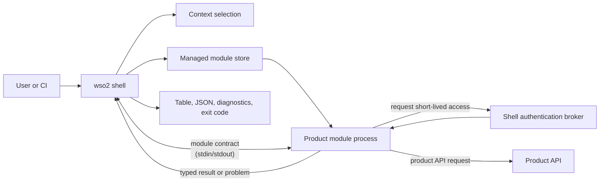
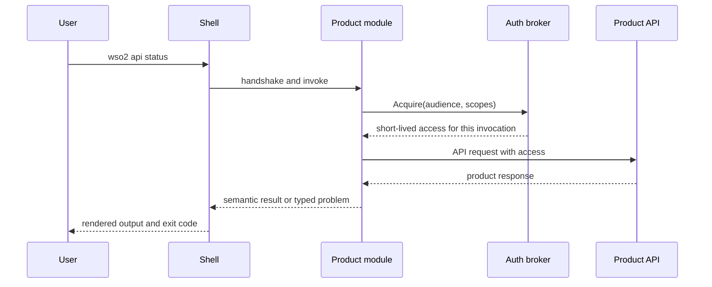
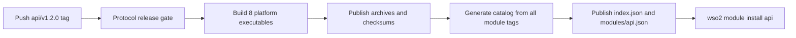

# Building a product module

**Status:** Working draft  
**Related:** [Architecture](../architecture.md),
[module catalog](../reference/module-catalog.md),
[release artifacts](../reference/release-artifacts.md),
[module manifest](../reference/module-manifest.md),
[module SDK](../reference/module-sdk.md),
[troubleshooting](troubleshooting-modules.md),
[ADR 0011](../adr/0011-local-module-install-through-a-development-origin.md),
[contributing](../../CONTRIBUTING.md)  
**Last reviewed:** 2026-09-01

For a WSO2 product team adding a module to this repository. A product module
owns one top-level command namespace, such as `api`, and is an independently
versioned executable. The shell owns installation, contexts, credentials,
protocol negotiation, and user-facing output. The module owns the product
commands and the calls to its product API.

Modules live in this repository and each is released by its own tag, on its own
schedule ([ADR 0006](../adr/0006-monorepo-modules-and-generated-catalog.md)).
[`modules/reference`](../../modules/reference/) is the example used throughout,
and its `whoami` command shows the whole path from a command handler, through
brokered access, to a typed result. Do not assign the reserved `reference`
namespace to a product.

## How the pieces fit



The process boundary lets a product release without a shell release, while
keeping shared security and UX policy in one place.

| The module author owns | The shell and SDK own |
| --- | --- |
| Namespace-specific commands, validation, product API calls, semantic results, and typed product errors | Command dispatch, installed-version selection, context selection, credential storage, access-token policy, protocol framing, output rendering, diagnostics, and exit-code mapping |

Two rules follow:

1. A module imports the public `github.com/wso2/wso2-cli/sdk/...` packages, never
   a shell `internal/...` package.
2. A module never writes to standard output, which carries the module contract.
   Return a `result.Result` or a typed `problem.Problem` and let the shell
   render it.

## 1. Create the module

One command creates a module that builds and passes its own test unedited:

```console
$ make new-module NAMESPACE=api
go run ./cmd/wso2-module-new -namespace 'api'
Created the api module in modules/api:
  modules/api/go.mod
  modules/api/module.json
  modules/api/README.md
  modules/api/cmd/wso2-module-api/main.go
  modules/api/cmd/wso2-module-api/main_test.go

Build and test it:
  go test ./modules/api/...
Then open modules/api/cmd/wso2-module-api/main.go
```

```console
$ go test ./modules/api/...
ok  	github.com/wso2/wso2-cli/modules/api/cmd/wso2-module-api	0.686s
```

Do not assemble a module by hand. The generator reads two facts from the
checkout that a hand-written module would have to guess: the SDK version to
build against, and the module contract versions to declare.

Choose the namespace first. It is the user's top-level command, the tag prefix,
the catalog identity, the executable name, and the installed-store key, so
changing it later is a migration rather than a rename. Four kinds of namespace
are refused, and nothing is written when one is:

```console
$ make new-module NAMESPACE=login
go run ./cmd/wso2-module-new -namespace 'login'
wso2-module-new: "login" is a shell command, so a module owning that namespace could never be reached; the shell owns config, context, doctor, help, identity, login, logout, module, org, version, whoami
exit status 1
make: *** [new-module] Error 1
```

The shell resolves its own commands before consulting an installed module, so a
module in a shadowed namespace would build, release, install, and then never
run. The other three refusals are a namespace another module declares, the
reserved `reference` namespace, and anything that is not lowercase letters and
digits starting with a letter.

### What it wrote

```text
modules/api/
├── go.mod
├── module.json
├── README.md
└── cmd/
    └── wso2-module-api/
        ├── main.go
        └── main_test.go
```

The directory name is only a source location; `module.json` declares the
namespace users type. The release tooling expects the main package at
`modules/<namespace>/cmd/wso2-module-<namespace>` and packages an executable of
that name.

```json
{
  "schemaVersion": 1,
  "namespace": "api",
  "compatibility": {
    "shell": ">=0.1.0 <2.0.0",
    "protocolVersions": [2]
  },
  "capabilities": {
    "authAudiences": [],
    "authScopes": []
  }
}
```

The [module manifest reference](../reference/module-manifest.md) documents every
field. Two matter now.

`compatibility.protocolVersions` is read from the SDK in your checkout, not
chosen. Do not invent a version, and do not compare your product version with
the shell version. The release gate accepts a module only when its declared
protocol intersects the protocol window of an already released shell.

`capabilities` are the upper bound on the audiences and scopes the module may
ever request, empty here because a new module asks for nothing yet. Keep them equal to the
`module.Options` declaration in the executable: installation records them in the
local receipt, and the broker refuses any access request the receipt did not
authorize. An audience added in one place and not the other fails at runtime,
not at build time.

#### Declare a logical audience, never a deployment value

Declare the stable name your API is known by, compiled in and identical against
every deployment. Never a client ID, a tenant URL, or anything else that differs
between customers.

The three deployments the shell supports each bind `aud` differently: to the
client ID on Asgardeo, the API resource identifier on Identity Server, and a
resource-server URI on Thunder. A module compiling any one of those in would
install only against the tenant it was built for.

The operator records the concrete value in `products.<namespace>.audience`, and
the shell proves the issued token is bound to that before handing anything over.
Ask for your logical name and let the shell do the rest.

### The versions your module depends on

```text
require (
	github.com/spf13/cobra v1.10.2
	github.com/wso2/wso2-cli/sdk v0.1.0
)
```

The SDK version says which Go API your module compiled against, and nothing
more. Below `1.0` it may break on a minor bump, so read the SDK's release notes
before moving it.

Whether a user's shell can launch your module is decided by the **protocol
version** instead: versioned separately, declared in `module.json`, checked by
the release gate, and negotiated at every invocation. Two modules built against
different SDK versions run on the same shell if they speak a protocol it speaks
([ADR 0009](../adr/0009-sdk-versioning-and-publication.md)).

## 2. Build commands with the SDK

The module executable supplies its identity and maps command paths to handlers.
The SDK handles handshake, framing, access-broker messages, result validation,
and protocol failures.

```go
package main

import (
	"context"
	"fmt"
	"os"

	"github.com/wso2/wso2-cli/sdk/module"
	"github.com/wso2/wso2-cli/sdk/result"
)

const (
	namespace = "api"
	// The logical name this API is known by, the same against every
	// deployment. The concrete string a deployment stamps into a token's aud
	// claim is the operator's to record in their context document, not yours
	// to compile in. See "Declare a logical audience, never a deployment
	// value" above.
	audience = "api.example.com"
	scope    = "api:read"
)

var moduleVersion = "0.0.0-dev"

func main() {
	err := module.Serve(context.Background(), module.Options{
		Namespace:     namespace,
		Version:       moduleVersion,
		AuthAudiences: []string{audience},
		AuthScopes:    []string{scope},
	}, module.Command{Path: []string{"status"}, Run: status})
	if err != nil {
		fmt.Fprintln(os.Stderr, err)
		os.Exit(1)
	}
}

func status(ctx context.Context, request module.Request) (result.Result, error) {
	return result.New("api.status/v1").With("status", "Status", "ready"), nil
}
```

The release tool injects `moduleVersion` from the module tag. Keep the
development value in source; do not hard-code a release version.

A handler receives the selected non-secret context, original product arguments,
requested output mode, a per-invocation ID, and an access broker. It does not
receive refresh tokens, client secrets, or the shell configuration store.

### Serving an existing Cobra command tree

A product CLI being migrated already has a Cobra command tree. `sdk/cobratree`
serves it directly, so the commands, their flags, and their help stay where they
are. Only the ending changes: a handler returns typed fields instead of
printing.

```go
func commandTree() *cobratree.Tree {
	root := &cobra.Command{Use: namespace}
	statusCommand := &cobra.Command{Use: "status", Short: "Report service status."}
	statusCommand.Flags().String("env", "", "Target environment.")
	root.AddCommand(statusCommand)

	return cobratree.New(root).Handle(statusCommand, status)
}
```

Serve it with `cobratree.Tree.Serve` in place of `module.Serve`:

```go
err := commandTree().Serve(context.Background(), options)
```

Return the tree rather than the commands it serves, and let `Serve` do both.
It declares the tree as well as serving it, and that declaration is what lets
the shell answer `wso2 <namespace> --help`, name a mistyped command, and parse
your flags before your module is launched. A module that hands `module.Serve` a
command list alone declares nothing, and the shell falls back to parsing a
product line without knowing what the module accepts.

The adapter parses the module's own arguments with the matched command's flag
set before the handler runs, so a handler reads its flags from the command it
was written beside.

The adapter guarantees two things. Every writer in the tree points at standard
error, and Cobra prints neither errors nor usage itself, so the tree cannot
corrupt the protocol frames on standard output. And a flag failure reaches the
shell as a typed usage problem rather than Cobra's own error text, so the user
sees a classified refusal instead of a module crash.

The limit: a handler that calls `fmt.Println` writes to standard output and
corrupts the stream, and no adapter can prevent that. Send diagnostics to
standard error, and return everything the user should see as result fields.

A command with no handler bound is not served, so the shell reports it as an
unknown command rather than as one that silently succeeded.

## 3. Request access only when the command needs it

For a protected product API, request access through `request.Access`. The shell
intersects the request with the installed module's declared capabilities, finds
the selected context, and returns short-lived access for this one invocation.

```go
access, err := request.Access.Acquire(ctx, module.AccessRequest{
	Audience: audience,
	Scopes:   []string{scope},
})
if err != nil {
	// This is a shell policy denial. Return it unchanged.
	return result.Result{}, err
}

response, err := callProductAPI(ctx, request.Context.Endpoint, access.Token)
if err != nil {
	return result.Result{}, err
}
return result.New("api.status/v1").
	With("status", "Status", response.Status), nil
```

The access token is opaque to the module. Do not parse it, log it, return it,
persist it, or pass it in command-line arguments. A module can spend access on
its product API but cannot refresh or broaden it.

The module must preserve this request flow:



## 4. Use `reference whoami` as the concrete example

`wso2 reference whoami` is small and still crosses every boundary that matters:

1. [`main.go`](../../modules/reference/cmd/wso2-module-reference/main.go)
   registers the `whoami` command and declares the `reference-status` audience
   and `reference:status:read` scope.
2. The `whoami` handler acquires that declared access through the broker.
3. [`whoami.go`](../../modules/reference/cmd/wso2-module-reference/whoami.go)
   calls the service endpoint from the selected context, sending the opaque
   access token and invocation ID.
4. The service verifies the token and returns non-secret claims: organization,
   audiences, scopes, and invocation binding.
5. The handler returns those claims as `reference.whoami/v1`, and the shell
   renders them as a table or deterministic JSON.

The boundary is in the right place: the service that verifies access is what
says what the access conveys. The module never inspects the token itself, and no
access material appears in its result or diagnostics.

## 5. Develop and test locally

For now, `go.work` composes the shell, SDK, and reference module. Run the
smallest relevant checks while working, then the acceptance gate before review:

```sh
# From the repository root.
go build ./...
(cd modules/reference && go test ./...)

# The SDK must also work outside workspace composition.
(cd sdk && GOWORK=off go test ./...)

# Full shell/module contract and acceptance proof.
./scripts/acceptance.sh
```

Unit-test handlers with [`sdk/testkit`](../../sdk/testkit/). It runs a command
through the real protocol framing with access you supply, so a test covers the
handler and its contract rather than the handler alone. `testkit.Run` takes the
module options and commands, and `testkit.Access` grants a token or, with
`Deny`, returns a broker denial. Never make a unit test depend on a real
identity provider.

Add acceptance coverage when a command changes the shell/module boundary, access
behavior, output schema, or a security property. The reference `whoami`
acceptance tests are the model: they check table output, JSON field order,
per-invocation binding, and that no access material is printed.

### Run it under the real shell before you tag

`sdk/testkit` is a conforming peer, not the shell: no receipt resolution, no
integrity check, no rendering. A module that satisfies it is not proven to
satisfy the shell. Install your unpublished module and find out:

```sh
make install-module NAMESPACE=api
./bin/wso2 api --help
./bin/wso2 module remove api
```

The ordinary installer builds, packs, and installs the module from a catalog
served on loopback for the length of the run. Nothing is made easier, so what
lands in your module store is a real installation that `wso2 module list`,
`update`, and `remove` all work on. It installs as the pinned prerelease
`0.0.0-dev`, so nobody following the stable channel is offered your build and a
published release will not replace it. Name another version with `VERSION=`.

`install-module` builds the shell too, which is why it prints `./bin/wso2`
rather than `wso2`. A shell built the ordinary way reports `0.0.0-dev`, which the
`>=0.1.0` range in your `module.json` does not contain, because a prerelease
sorts below its own release. Such a shell would install a module and then refuse
to launch it, so the module is installed for the version that same run built.

`SHELL_VERSION` overrides that, and you need it only to run a different `wso2`,
such as one installed from a release. Any version inside your declared range
works. `make build-shell` builds the shell without installing anything.

Installing for a released `wso2` takes one more fact: its version says nothing
about the module-contract protocol it speaks, and that is what selection decides
over. Run the command directly and tell it, using what `wso2 version` prints:

```sh
go run ./cmd/wso2-module-dev -namespace api \
  -shell-version 1.2.0 -shell-protocols 2,1 -shell-path /usr/local/bin/wso2
```

Naming another shell's version without its protocol window is refused rather
than assumed, because assuming this checkout's window is what would install a
module that shell then refuses to launch.
[ADR 0011](../adr/0011-local-module-install-through-a-development-origin.md)
covers why this goes through the real catalog rather than writing the store
entry directly.

In a real product repository, use the SDK as a normal published dependency. A
module's `go.mod` must not contain a `replace` directive: the workspace
replacement here is temporary composition for the unpublished SDK.

## 6. Release and publish the catalog entry

One module tag triggers the complete release flow. For namespace `api`, tag a
semantic version in this form:

```text
api/v1.2.0
```

The tag is a module release, not a shell or SDK release. The workflow then runs
this sequence:



The release tool builds archives for the supported shell platforms, injects the
module version and the SDK version it was built against, and publishes
`checksums.txt`. Catalog generation then reads the tag, the `module.json` as it
existed at that tag, and the published assets. Nobody hand-writes a catalog
entry.

The shell discovers a module from `index.json`, fetches that namespace's
history only when it must select a version, verifies the downloaded archive
against its catalog digest, and atomically activates the new installed version.
Normal product commands run from that local managed store and do not need the
catalog.

Run the gate alone before you tag. It answers the one question a tag cannot take
back: can any shell that exists launch what you are about to publish?

```console
$ go run ./cmd/wso2-module-release -tag api/v1.2.0-rc.1 -gate-only
api/v1.2.0-rc.1 speaks module-contract protocol v2 and the released shell speaks v2, v1
```

For the full artifact check without publishing:

```console
$ go run ./cmd/wso2-module-release -tag api/v1.2.0-rc.1 -out dist
...
8 archives and checksums.txt written into dist
```

Run this only after the module is under `modules/` with a valid declaration. It
writes build artifacts to `dist/`; do not commit them.

A version carrying a prerelease identifier, such as `api/v1.2.0-rc.1`, publishes
on the prerelease channel: installable by anyone who asks for that channel, and
offered to nobody following the stable one. Release a first module there.

## 7. Install, update, and remove it

This is what a user does, and it is worth running once rather than reading
about. Installing your own unpublished build needs no tag, and `make
install-module` above already did that. What follows runs against the module
this repository actually publishes, `modules/reference`, reading the deployed
catalog at `https://wso2.github.io/wso2-cli` on the prerelease channel.
`WSO2_HOME` points at an empty directory, so the run starts with no installed
modules and no receipts, like a user's machine the first time:

```console
$ export WSO2_HOME=$(mktemp -d)
$ wso2 module available
MODULE      CHANNEL      VERSION
reference   prerelease   v0.1.0-rc.4

Run wso2 module install <module> to install one.
```

Installing without naming a channel resolves the stable channel, and the
reference module has never published to it:

```console
$ wso2 module install reference
error: the "reference" module publishes no version on the stable channel (catalog.empty_channel)
  It publishes on prerelease. Choose one with --channel.
```

```console
$ wso2 module install reference --channel prerelease
Installed reference v0.1.0-rc.4 for darwin/arm64.
The artifact was checked against the digest the catalog publishes. Artifacts are integrity-checked, not signed.
```

Asking for a channel resolves the newest version on it that this shell can
launch on this platform, verifies the archive against the digest the catalog
published, and writes a receipt recording what it installed. It also keeps
working as new prerelease versions ship. Pin an exact version with
`<namespace>@<version>` in a pipeline instead, so its behavior does not depend
on what is newest that day.

```console
$ wso2 module list
MODULE      INSTALLED     CHANNEL      UPDATE
reference   v0.1.0-rc.4   prerelease   current

Every installed module is current.
```

```console
$ wso2 module update reference
reference is current at v0.1.0-rc.4.
```

`wso2 module update --all` does the same for every installed module at once,
and asks for confirmation first unless you pass `--yes`.

Removing takes the module off the machine: its versions, its receipts, its
active-version pointer, and its version policy, and nothing else. It is not a
logout, and it leaves your configuration and credentials alone.

```console
$ wso2 module remove reference --yes
Removed the reference module.
```

Removing something that is not installed is refused rather than reported as
done, so you can tell a typo from a no-op:

```console
$ wso2 module remove reference --yes
error: no reference module is installed (shell.module_not_installed)
  Run wso2 module list to see what is installed.
```

Remove and reinstall freely while iterating. Removal leaves no receipt or
version directory behind, so the next install resolves cleanly.

## Product-module checklist

Before asking for review, confirm that:

- the module was created with `make new-module`, not assembled by hand
- the namespace is assigned and appears identically in `module.json`,
  `module.Options`, the executable path, and the intended tag
- the module imports public SDK packages only and has no `replace` directive
- every audience and scope requested at runtime is declared in both
  `module.json` and `module.Options`
- handlers return `result.Result` values or typed problems, rather than
  formatting output or choosing exit codes
- access tokens and other credentials cannot reach output, logs, files,
  arguments, or environment variables
- the generated test still passes, and unit and acceptance tests cover the new
  command's behavior
- `./scripts/acceptance.sh` passes from a clean checkout
