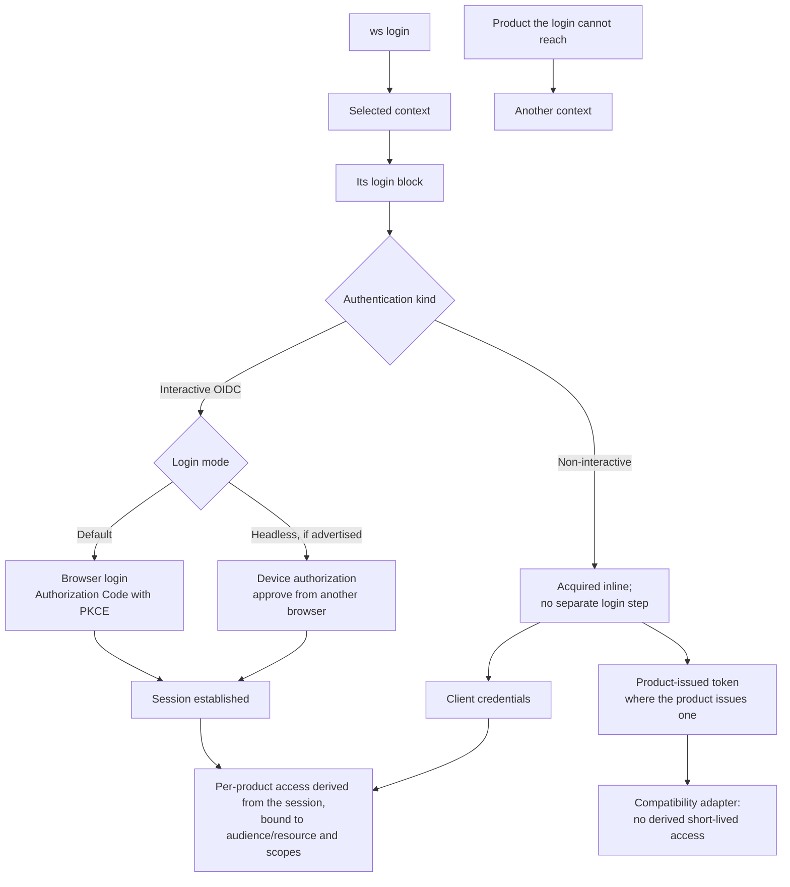

# WSO2 CLI product requirements

**Status:** Working draft  
**Related:** [Architecture](architecture.md), [decision records](adr/)

## 1. Summary

WSO2 provides one command, `ws`, as the common shell for WSO2 product
CLIs. Product teams will continue to own their product-specific commands and
release them independently as WSO2-published modules.

The shell will provide a consistent experience for authentication, contexts,
configuration, help, output, errors, module lifecycle, security, and version
reporting. The first implementation will be written in Go. A shared Go SDK will
make compliant product modules straightforward to build and will provide the
common behavior by default.

## 2. Problem

WSO2 currently ships several product CLIs with different:

- binary and command names;
- command structures;
- login and credential-storage mechanisms;
- context and endpoint configuration;
- help and version behavior;
- structured-output support;
- error formats and exit codes;
- installation and update processes.

A developer using more than one WSO2 product must learn and automate several
different interfaces. Product teams also repeatedly implement the same
cross-cutting CLI features. This makes the experience harder for people, CI
systems, and coding agents.

## 3. Product vision

Users should be able to install one CLI and use a predictable command model
across WSO2 products:

```text
ws <product> <resource> <action> [flags]
```

For example:

```shell
ws apim api list
ws iam app list
ws intg component deploy --file integration.yaml
ws am project list
```

Root commands manage capabilities shared across products:

```shell
ws login
ws whoami
ws context list
ws product list
ws version
ws doctor
```

## 4. Goals

### 4.1 Consistent user experience

- Provide one discoverable `ws` entry point.
- Use consistent command, flag, help, output, error, and exit-code conventions.
- Support both interactive use and deterministic non-interactive automation.
- Present product commands through stable top-level product namespaces.

### 4.2 Shared platform capabilities

- Centralize authentication and secure credential storage.
- Centralize cloud, on-premises, organization, project, region, and endpoint
  context.
- Provide consistent table and JSON output.
- Provide stable machine-readable errors and documented exit codes.
- Provide a coherent help tree across the shell and installed modules.

### 4.3 Independent product ownership

- Let product teams own their command implementations and release cadence.
- Avoid compiling every product CLI into the root binary.
- Make product modules easy to author through a shared Go SDK.
- Provide a migration path for existing Go/Cobra CLIs.

### 4.4 Managed module lifecycle

- Discover, install, update, verify, roll back, list, and remove official
  WSO2 product modules.
- Allow modules to be pinned for reproducible CI environments.
- Support pre-installation, and later offline bundles, for restricted networks.
- Report the root CLI and module versions without executing arbitrary binaries
  merely to discover their versions.

### 4.5 Secure software supply chain

- Install only WSO2-published modules in the first release.
- Check a downloaded artifact against the size and digest the module catalog
  publishes, and check compatibility and conformance, before activating it.
- State plainly that artifacts are integrity-checked and not signed, so that
  nobody over-reads what a digest proves.
- Prevent silent downgrade and arbitrary `PATH` shadowing.
- Keep long-lived credentials out of product modules.

## 5. Non-goals for the first release

- A marketplace for third-party or community plugins.
- Running product modules as untrusted code.
- Rewriting product business logic inside the root CLI.
- Requiring all product modules to share the root CLI release cadence.
- Unifying the backend APIs of WSO2 products.
- Supporting arbitrary in-process Go plugins.
- Providing a general package manager for non-CLI WSO2 software.
- Guaranteeing an OS-level sandbox for native product modules.

## 6. Users

### Developers and operators

They use multiple WSO2 products interactively and need a consistent,
discoverable command experience.

### CI/CD and platform automation

They need non-interactive authentication, pinned versions, structured output,
stable errors, and offline or pre-installed modules.

### Coding agents

They need predictable help, schemas, machine-readable output, and errors that
describe safe recovery actions.

### WSO2 product teams

They need an SDK, test kit, publishing contract, and independent release flow
that avoid reimplementing common CLI infrastructure.

## 7. Product requirements

Requirements are classified as:

- **P0:** required for the initial usable platform;
- **P1:** required before broad product adoption;
- **P2:** valuable follow-up work.

### 7.1 Root command and namespaces

- **P0:** One installed root command. Its name is set at build time (release
  default `ws`); this document writes it as `ws`.
- **P0:** Built-in root commands always take precedence over module namespaces.
- **P0:** Each module owns exactly one registered top-level product namespace.
- **P0:** Namespaces are assigned in this repository and published through the
  module catalog.
- **P0:** The shell resolves modules only from its managed store, never by
  searching arbitrary `PATH` entries.
- **P1:** The shell can suggest installation when a known official namespace is
  not installed.

The product namespaces are `iam`, `apim`, `am`, and `intg`
([ADR 0015](adr/0015-one-word-per-concept-in-the-command-surface.md)).

### 7.2 Authentication and credentials

> **What ships today.** The shell implements browser Authorization Code with
> PKCE, the Device Authorization Grant, and inline client credentials. Personal
> access tokens are legal configuration and refuse at use with
> `auth.kind_not_implemented`.

- **P0:** The root shell owns authentication sessions and credential storage.
- **P0:** A context's **login** serves every product for which the shell can
  obtain valid access from that login's sign-on without another credential.
- **P0:** Where a product requires another login or an independently supplied
  credential, it belongs to another context.
- **P0:** Sharing an identity provider or issuer URL does not by itself make
  products share a login. The sign-on must be able to produce access each
  product accepts.
- **P0:** Product access obtained through a shared login is restricted by
  audience/resource and by scope wherever the deployment supports it. Where a
  requested narrowing is unavailable, the shell refuses rather than silently
  issuing broader or incorrectly targeted access.
- **P0:** An interactive OIDC context logs in with browser Authorization Code
  with PKCE by default. `ws context create --device` makes it log in with
  device authorization instead, available only where the backend advertises
  the grant.
- **P0:** Device authorization remains an interactive developer login mode; it
  is not a CI authentication method.
- **P0:** An on-premises context explicitly identifies its product URLs and authentication method. Login uses only mechanisms supported by
  that deployment.
- **P0:** The CLI does not assume that an on-premises deployment has WSO2 Cloud
  SSO, WSO2 Identity Server, or any other shared login service.
- **P0:** CI authentication is non-interactive and uses client credentials, a
  personal access token where the product issues one, or a future
  workload-account mechanism. CI must never start browser login or device
  authorization.
- **P0:** A non-interactive method establishes no reusable session, so the shell
  acquires access inline during the invoking command and CI requires no separate
  login step.
- **P0:** Authentication that cannot yield derived, short-lived access is
  compatibility-adapter territory. A module reached that way does not carry the
  same trust property, and the difference is stated rather than presented as
  equivalent.
- **P0:** Interactive long-lived credentials are stored in the OS keychain or
  another approved secure store, not in context files.
- **P0:** CI secrets come from the CI system's secret store, remain only in job
  memory, and are not written to the OS credential store or filesystem.
- **P0:** Modules request short-lived or invocation-scoped credentials through
  the shell's private authentication broker. Audience and scope are restricted
  whenever the deployment's authentication mechanism supports them.
- **P0:** Modules request an audience and scopes and receive access material.
  They never receive refresh tokens, client secrets, or personal access tokens,
  and never learn whether the shell used refresh, token exchange, client
  credentials, a personal access token, or a compatibility adapter.
- **P0:** Secret values are never placed in command-line arguments, context
  files, logs, receipts, or module configuration, and are never forwarded to a
  module through its environment. CI names the environment variable that holds
  a secret; the shell reads the value directly into memory.

#### User-facing login decision tree



A context contains only its authentication kind and non-secret references,
such as an opaque secure-store reference or CI variable name, never a
credential.

Shared-login success means one credential entry, and access that is bound to
one product's audience and scopes: a separate session where the product holds
one, and a token exchanged per command where it does not
([ADR 0014](adr/0014-one-login-one-session-per-product.md)). It does not mean
one token reused across products.

### 7.3 Contexts

A context owns its login, its products, and its sessions
([ADR 0016](adr/0016-a-context-owns-its-login-and-sessions.md)). There is no
separate account record.

- **P0:** A context holds one login block (authentication kind, issuer,
  client, optional tenant and provider, CI variable name, login product), its
  product entries (URL, audience/resource, scopes, grant), its organization
  and project, and one credential reference.
- **P0:** No two contexts share a credential reference, so changing, logging
  out of, or deleting one context never touches another's sessions.
- **P0:** Several organizations reached through one login are one context,
  switched with `ws org use`. Two targets that must be selectable by name are
  two contexts, each logging in on its own.
- **P0:** A context lists several products only where its login can reach
  them. A product that needs separate authentication belongs to another
  context.
- **P0:** A context stores only non-secret identifiers, an opaque secure-store
  reference, or the name of a CI-provided variable.
- **P0:** The context document is complete: product-descriptor defaults are
  written into it when a context is created or applied, and nothing is derived
  at command time.
- **P0:** A platform team can share a short input file; `ws context apply`
  turns it into complete records. An input file never names a credential
  reference or a selection.
- **P0:** Users can select a default context or override it for one command.
  Selection is deterministic: `--context`, then `WSO2_CONTEXT`, then the
  selected context, then none.
- **P0:** Selecting a context never authenticates.
- **P0:** Creating, applying, or editing a context grants no access by itself.
- **P1:** Login may create the context it authenticates, naming it and
  reporting what it created.
- **P1:** Contexts can be exported without credentials.
- **P2:** A context may be bound to a product namespace, so a deployment that
  needs separate logins per product does not force `--context` on every
  command. Not built.

### 7.4 Output, errors, and help

- **P0:** All compliant modules support `table` and `json` output through the
  shell's rendering.
- **P0:** Non-interactive output is stable and contains no decoration unless
  explicitly requested.
- **P0:** Errors have a stable category, code, message, and recovery
  suggestion.
- **P0:** Exit codes are defined centrally and tested for conformance.
- **P0:** Secret values are automatically redacted from errors and debug logs.
- **P0:** Root and product help use common templates and terminology.
- **P0:** Modules expose command metadata so the root can discover and summarize
  installed product commands.
- **P1:** The command metadata can be consumed by coding agents and completion
  generators.

### 7.5 Module authoring

- **P0:** A shared Go SDK supplies the mandatory module protocol and common
  behavior.
- **P0:** Authors implement product commands and return typed results or typed
  problems rather than implementing output and error formatting repeatedly.
- **P0:** The SDK integrates naturally with Cobra because the identified WSO2
  product CLIs already use Go and Cobra.
- **P0:** A conformance test kit validates the handshake, protocol compatibility,
  help, flags, output, errors, authentication use, and secret redaction.
- **P1:** Existing CLIs can migrate incrementally through a compatibility
  adapter, but only fully conformant modules are presented as conformant.
  Conformance is a protocol and behavior property and carries no
  supply-chain claim.

### 7.6 Module installation and management

- **P0:** Users can list available and installed official modules, with
  available updates, in one command.
- **P0:** Users can install a module's newest compatible version on a channel,
  or install and pin an exact version without pinning the rest.
- **P0:** Installation is staged and activated only after verification
  succeeds; an update keeps the working version until the replacement is
  active.
- **P0:** An update check costs one catalog request whatever is installed, and
  its cost does not grow as products accumulate releases.
- **P0:** Module updates are explicit. Non-interactive and offline execution
  performs no implicit catalog check, install, or update, so CI runs pinned,
  pre-installed modules without network access.
- **P1:** Interactive update notices appear only after the requested command
  completes and never reach standard output. Not built.
- **P1:** Users can verify installed modules and roll back to a retained
  version. Not built.
- **P1:** A fresh air-gapped machine can install the shell and selected
  modules from one platform-specific offline bundle, and an existing
  installation can import one. Deferred; the trust model must be reconciled
  with the integrity-only position in [architecture](architecture.md) section
  9.2 first.
- **P1:** Organizations can use an approved mirror without changing trust
  guarantees.

Command surface:

```shell
ws product list
ws product install iam
ws product install iam@0.2.0   # installs and pins
ws product update iam
ws product update --all
ws product remove iam
```

### 7.7 Versions

The product must distinguish:

1. the root `ws` CLI version;
2. the module protocol version;
3. each independently released product-module version.

`ws version` must work without network access and report the root version,
protocol version, platform, and installed-module versions. Module inventory is
read from receipts, whose integrity the shell checks, rather than by running
every module executable.

The CLI may also show available versions after an explicit metadata
refresh or network-enabled check.

### 7.8 Security

- **P0:** Every platform artifact has a cryptographic digest published in the
  module catalog, and a download that does not match it is refused, leaving
  nothing installed.
- **P0:** The CLI tells a user plainly that artifacts are integrity-checked and
  not signed, so that nobody over-reads what a digest proves.
- **P0:** Publishing to the catalog origin is protected by branch protection
  and required review on the workflows that publish, because no signature
  protects it.
- **P0:** Installations reject incompatible shells, incompatible protocols,
  unsupported platforms, unsafe archives, and modified binaries.
- **P0:** A module release is refused when the released shell speaks no
  protocol the module declares, so the shell always ships first.
- **P0:** Every launch validates the active module's receipt and executable
  integrity.
- **P0:** Updates use immutable version directories and atomic activation.
- **P1:** Signing the catalog is a tracked follow-up, so that the removal of
  publisher signing is a recorded deferral rather than an omission.
- **P1:** The publishing gate includes vulnerability, license, and conformance
  checks.
- **P2:** Platform-specific sandboxing may be added as defense in depth.

## 8. User experience principles

- Cloud is the default; on-premises targeting is explicit.
- Commands never guess between multiple contexts or products.
- Human-friendly defaults do not compromise deterministic automation.
- Common flags have the same names and meaning everywhere.
- Destructive operations require explicit intent and support non-interactive
  confirmation controls.
- Errors state what failed, why it failed, and the next safe action.
- Automatic module download is opt-in in CI and controllable interactively.

## 9. Delivery stages

These stages describe product-level progression, not task order. Open work is
tracked in [GitHub issues](https://github.com/wso2/wso2-cli/issues).

1. **Foundation** (done): shell, context and credential model, SDK and module
   protocol, output and error conventions, managed store and receipts,
   generated catalog, test kit.
2. **Pilot modules**: migrate two product CLIs with different internal
   shapes, one factory-injected Cobra root and one with global
   initialization.
3. **Managed distribution**: publishing gate, update and pinning (done);
   rollback, platform installers, offline bundles.
4. **Product adoption**: remaining product CLIs, authoring guidance, and
   deprecation guidance for old binary names.

## 10. Success criteria

- A user installs one root CLI and can discover and use multiple product
  namespaces.
- Cloud developer login uses Authorization Code with PKCE by default, and a
  headless machine logs in with device authorization where the backend
  advertises it.
- One credential entry serves every product a context reaches, and each
  product holds its own audience- and scope-bound session rather than one
  token reused across products.
- A product the login cannot reach is served by a separate context, and the
  CLI says so instead of failing obscurely.
- On-premises login follows the authentication kind declared in the selected
  context without assuming a shared WSO2 login service.
- CI authentication completes non-interactively, without a separate login step,
  without invoking browser or device authorization, and without persisting
  secret values.
- The pilot modules use the root authentication broker and store no long-lived
  credentials.
- The same command result renders as valid table and JSON.
- All pilot modules pass the shared output, error, help, security, and protocol
  conformance suite.
- A failed or maliciously modified update cannot replace the active working
  module.
- An installed version can be pinned and reproduced in CI without implicit
  network access.
- Product authors can create a minimal compliant module without implementing
  authentication, output formatting, error formatting, or help templates.
- Root and module versions are reported independently and unambiguously.

## 11. Decisions already made

- The shell is implemented in Go, in `github.com/wso2/wso2-cli`.
- Product functionality remains in independently released modules, in one
  repository with a generated catalog
  ([ADR 0006](adr/0006-monorepo-modules-and-generated-catalog.md)).
- First-release modules are WSO2-published product modules only.
- The architecture is SDK-first hybrid: managed out-of-process executables plus
  a mandatory module contract and shared Go SDK.
- Shared authentication, output, errors, and help are required behavior, not
  optional conventions.
- Artifacts are integrity-checked, not signed; process separation is not
  treated as a sandbox.
- Product namespaces are `iam`, `apim`, `am`, and `intg`; the
  shell's module commands are `ws product`, and one `ws product list`
  reports installed versions and available updates
  ([ADR 0015](adr/0015-one-word-per-concept-in-the-command-surface.md)).
- A context owns its login and sessions
  ([ADR 0016](adr/0016-a-context-owns-its-login-and-sessions.md)).
- Supported platforms are listed in
  [release artifacts](reference/release-artifacts.md#supported-targets).

## 12. Open decisions

- Which two existing CLIs will be the pilot migrations.
- Whether first interactive use of an uninstalled product may install it
  automatically or must ask.
- Module retention policy and the number of rollback versions.
- The owner and timing of catalog signing.
- Compatibility and deprecation period for existing standalone CLI names.
- Deployment discovery from one URL
  ([#196](https://github.com/wso2/wso2-cli/issues/196)).
- Using a single product without ThunderID
  ([#197](https://github.com/wso2/wso2-cli/issues/197)).
- A seeded public CLI client in Asgardeo and Identity Server
  ([#198](https://github.com/wso2/wso2-cli/issues/198)).
